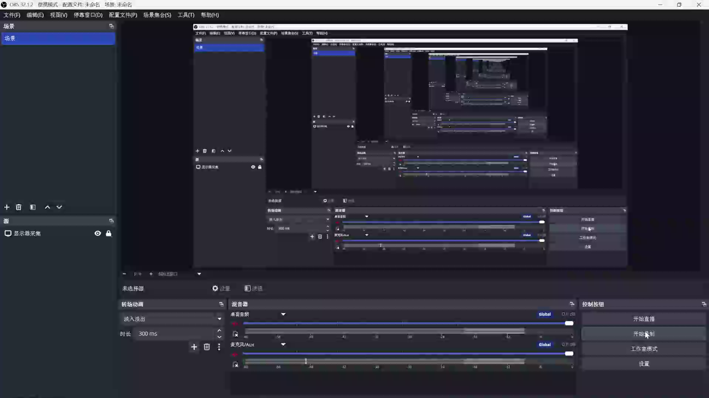

> [English](./README.md) | [中文](./README.zh-CN.md)

# Word MCP Server

<p align="center">
  <a href="https://raw.githubusercontent.com/HelloWorld-Open/word-mcp-server/main/assets/demo/demo.mp4">
    
  </a>
</p>

[](https://github.com/HelloWorld-Open/word-mcp-server/actions/workflows/ci.yml)
[](https://opensource.org/licenses/MIT)
[](https://nodejs.org)
[]()

让你的 AI 智能体直接操控 Microsoft Word — 创建、编辑、排版文档，就像真人坐在电脑前操作一样。

Word 以可见窗口运行，每条修改即时呈现，撤销栈全程正常。

> 此工具仅供已有 Word 授权的用户合法使用。不包含、不破解、不分发 Microsoft Office 软件。

---

## 🤖 兼容的 AI 智能体

支持所有 MCP 兼容客户端，配置即用：

| 生态 | 智能体 |
|------|--------|
| **Claude** | Claude Desktop、Claude Code（CLI） |
| **IDE** | Cursor、VS Code + Continue / Cline |
| **AI 终端** | OpenCode、Codex CLI |
| **其他** | 任意支持 stdio 的 MCP 客户端 |

## 💼 典型场景

| 场景 | 一句话描述 |
|------|-----------|
| **周报月报** | Agent 拉取数据 → 写报告 → 排版 → 保存，一气呵成 |
| **合同草拟** | 填入变量模板 → 生成正式合同 → 导出 PDF |
| **学术论文** | 撰写结构化内容 → 插入表格图表 → 格式化引用 |
| **批量生成** | 一条指令从 JSON/CSV 生成 100+ 份标准化文档 |
| **自动化测试** | 在 CI 流程中自动创建 Word 文档用于测试验证 |

## ⚡ 快速开始

```bash
git clone https://github.com/HelloWorld-Open/word-mcp-server.git
cd word-mcp-server
npm install && npm run build
```

添加到 MCP 客户端配置：

```json
{
  "mcpServers": {
    "word": {
      "command": "node",
      "args": ["D:\\path\\to\\word-mcp-server\\build\\parent.js"]
    }
  }
}
```

> `npm install` 时需要 MSVC Build Tools 编译 winax 原生模块。如报错请安装 Visual Studio 2022 Build Tools（选择"使用 C++ 的桌面开发"工作负载）。

然后直接对你的 AI 智能体说：*"帮我写一份周报到 Word"* 或 *"根据这个模板生成一份合同"*。

### 🎯 试试这句话

配置好后，对 AI 说这句话，即刻生成一份专业会议纪要：

> **制作一份会议纪要**
>
> 1. 标题：「产品需求评审会 — 2025.06.12」
>    → 微软雅黑 22pt 粗体，居中对齐
> 2. 正文写一段会议概述：时间（2025年6月12日 14:00-16:00）、地点（3楼会议室A）、参会人（产品经理1人、研发3人、测试2人、设计1人）、会议目的（评审Q3需求，确认Sprint排期）
>    → 等线 12pt，1.5 倍行距
> 3. 插入一个 **4 列 × 4 行** 表格，填入真实数据：
>    - 列名：评审议题 | 结论 | 负责人 | 截止日期
>    - 第1行：用户中心改版 | 通过评审，需补充异常流程 | 张三 | 2025-07-01
>    - 第2行：消息推送优化 | 技术方案需调整 | 李四 | 2025-06-30
>    - 第3行：数据看板新增 | 通过评审，按计划推进 | 王五 | 2025-07-15
>    - 表头：等线 11pt 粗体，深蓝底 #2B579A + 白字
>    - 内容：等线 10.5pt，轻量网格边框
> 4. 文末追加 **3 条待办事项** 的项目符号列表：
>    - 张三于6月20日前提交用户中心改版详细设计文档
>    - 李四于6月18日前与后端团队确认消息推送优化方案
>    - 全体参会人员于6月16日前在共享文档中补充反馈意见
>    → 等线 11pt
>
> → 保存到桌面「会议纪要_产品评审.docx」

Agent 会自动打开 Word、写入内容、排版表格、保存——全程实时可见。

## ✨ 为什么选择 Word MCP Server

每个特性都为 AI 智能体操控 Word 而设计：

| 能力 | 对 AI 场景的意义 |
|------|----------------|
| **108 个 MCP 工具** | Agent 能精确控制每个细节 — 文本、格式、表格、图表、图片、书签、页眉、脚注、批注 |
| **实时可见** | 看着 Agent 工作，发现错误可随时干预 |
| **Manager API** | Agent 一条指令完成复杂任务：`设置页眉 → 插入页码 → 插表格 → 书签` |
| **Ctrl+Z 友好** | 所有操作走 COM API，撤销栈完好。Agent 搞砸了你可以手动撤回 |
| **断线不丢** | MCP 断开后 Word 窗口保持打开，编辑不会丢失 |
| **自动备份** | 每次保存自动创建 `.bak`，放心让 Agent 操作 |
| **图表数据隔离** | 独立子进程 + 15s 超时，防止 Excel COM 挂死 Word |
| **安全内置** | 目录穿越防护、宏强制禁用、Zod 输入校验、限流、审计日志、错误脱敏 |

## 🛠️ 使用示例

### 流式 Markdown 写入（推荐）

```
word_stream_start title:"我的报告"
word_stream_block text:"# 标题\n\n正文内容..."
word_stream_end
```

流式 API 创建文档、逐块写入 Markdown、保存。支持完整 Markdown 语法：标题、粗体、斜体、代码、表格、列表、链接、删除线、引用、分隔线、代码块。

使用 `baseStyleProfile` 预配置样式字体和段落格式：

```
word_stream_start title:"论文" baseStyleProfile:{"Normal":{"font":{"name":"SimSun","size":12},"paragraph":{"firstLineIndent":0.74}}}
```

### 高层 Manager API

```
word_mgr_set_header text:"报告" alignment:"center"
word_mgr_set_page_numbers target:"footer"
word_mgr_insert_table rows:5 cols:3 data:[["A","B","C"],["1","2","3"]]
word_mgr_add_bookmark name:"section1"
```

Manager API 自动处理光标定位、段落分隔和屏幕刷新。

## 📝 内置提示词 (Prompts)

三个 MCP 提示词模板帮助 Agent 遵循最佳实践工作流：

| 提示词 | 描述 |
|--------|------|
| `create_report` | 生成创建结构化 Word 报告的步骤计划（标题、章节、风格） |
| `format_document` | 获取格式化现有文档的指导工作流 |
| `state_machine` | 解释 4 状态 + 2 子状态模型及正确操作顺序 |

## 📖 完整工具参考

详见 **[TOOLS.zh-CN.md](./TOOLS.zh-CN.md)** — 108 个工具，涵盖 12 个模块：文档生命周期、内容编排、格式排版、表格、图表、图片、文本框、结构、剪贴板、Manager API、语义定位、变量替换。

## 🏗️ 架构

### 通信流程

```
MCP Client (Claude Desktop、Cursor、OpenCode 等)
    │  JSON-RPC over stdio
    ▼
build/parent.js  (看门狗 — 30s 超时，崩溃重启)
    │  spawn + 管道转发
    ▼
build/child.js   (McpServer)
    │  winax COM Automation（原生调用）
    ├─ 主线程：108 个工具
    └─ 子进程：图表数据设置（fork + 15s 超时）
            │
            ▼
        WINWORD.EXE  (可见窗口)
```

### 源码结构

```
src/
├── index.ts            # 入口
├── parent.ts           # 看门狗父进程（30s 超时、崩溃重启）
├── child.ts            # MCP 服务器进程
├── server/             # MCP 协议层
│   ├── create-server.ts
│   ├── server-context.ts      # 共享会话依赖
│   ├── session-director.ts    # 会话编排（流锁、编辑模式管理）
│   ├── tools/                 # 12 个工具模块（108 个工具）
│   │   ├── content.ts
│   │   ├── document.ts
│   │   ├── formatting.ts
│   │   ├── helper.ts
│   │   ├── manager.ts         # 高层 Manager API
│   │   ├── media.ts
│   │   ├── reader.ts
│   │   ├── semantic.ts
│   │   ├── stream.ts          # 流式文档写入（推荐）
│   │   ├── structure.ts
│   │   ├── tables.ts
│   │   └── variable.ts
│   └── prompts/               # 内置提示词模板（3 个）
│       ├── report-prompts.ts
│       └── state-machine.ts
├── word/              # Word COM 自动化核心（19 个模块）
│   ├── session.ts
│   ├── application.ts
│   ├── document.ts
│   ├── document-registry.ts
│   ├── word-base.ts
│   ├── word-text-editor.ts
│   ├── word-markdown.ts
│   ├── word-stream-writer.ts
│   ├── word-table-editor.ts
│   ├── word-media-editor.ts
│   ├── word-document-structure.ts
│   ├── formatting.ts
│   ├── cursor-position.ts
│   ├── position-map.ts
│   ├── variable-replacer.ts
│   ├── chart-data-bridge.ts
│   ├── chart-data-worker.ts
│   ├── process-monitor.ts
│   └── types.ts
└── security/          # 5 层安全防御
    ├── path-sanitizer.ts
    ├── policy.ts
    ├── rate-limiter.ts
    ├── audit.ts
    └── errors.ts
```

## 🔒 安全机制（5 层防御）

- **路径消毒** — 7 种攻击向量防护（目录穿越、设备路径、网络路径、跨盘符、系统目录、NTFS 数据流、白名单）
- **宏保护** — 启动时强制禁用宏（`AutomationSecurity = 3`）
- **参数校验** — 所有工具输入经 Zod 运行时校验
- **限流** — 滑动窗口，可通过 `RATE_LIMIT_WINDOW_MS`/`RATE_LIMIT_MAX_CALLS` 配置
- **审计日志** — 每次工具调用记录时间戳、耗时、成功/失败、脱敏参数
- **错误脱敏** — 路径替换为占位符，不泄露内部细节

## 🧪 测试

**106 个测试，全部通过** ✅ — 9 个单元测试 + 1 个集成测试。

单元测试 mock 了 winax 层，不需要真实 Word 环境。覆盖率：Markdown 解析器 33、语义定位 21、文本编辑器 6、会话 13、安全层 30。

```bash
npm test
```

## ⚙️ 环境变量配置

通过项目根目录的 `.env` 文件配置，详见 `.env.example`：

| 变量 | 默认值 | 说明 |
|------|--------|------|
| `ALLOWED_DIRECTORIES` | *(不限制)* | 分号分隔的目录白名单 |
| `ALLOW_NETWORK_PATHS` | `false` | 是否允许网络路径 |
| `MAX_FILE_SIZE` | `52428800` | 最大文件大小（字节） |
| `MAX_TEXT_LENGTH` | `1000000` | 最大文本长度（字符） |
| `OPERATION_TIMEOUT_MS` | `30000` | 工具操作超时（毫秒） |
| `RATE_LIMIT_WINDOW_MS` | `5000` | 限流滑动窗口（毫秒） |
| `RATE_LIMIT_MAX_CALLS` | `30` | 窗口内最大调用次数 |
| `WATCHDOG_TIMEOUT_MS` | `30000` | 子进程无输出超时（毫秒） |
| `WATCHDOG_INTERVAL_MS` | `5000` | 看门狗健康检查间隔（毫秒） |
| `CHART_OP_TIMEOUT` | `15000` | 图表操作超时（毫秒） |
| `CHART_WORKER_IDLE_TIMEOUT` | `60000` | 图表 worker 空闲超时（毫秒） |

## 📄 许可

[MIT](./LICENSE)
